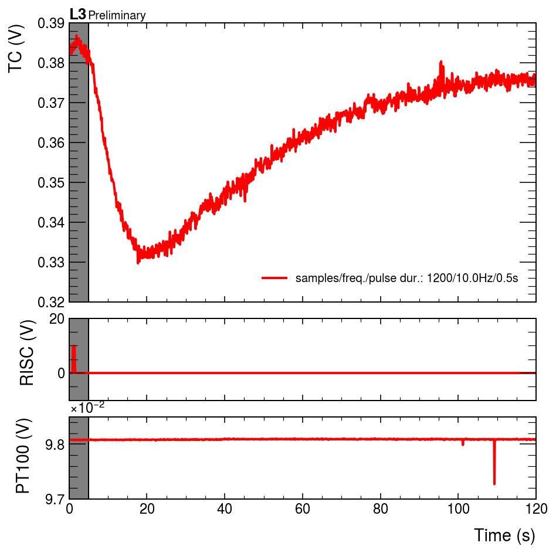
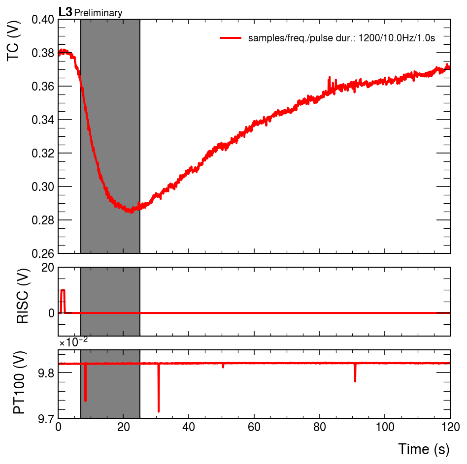
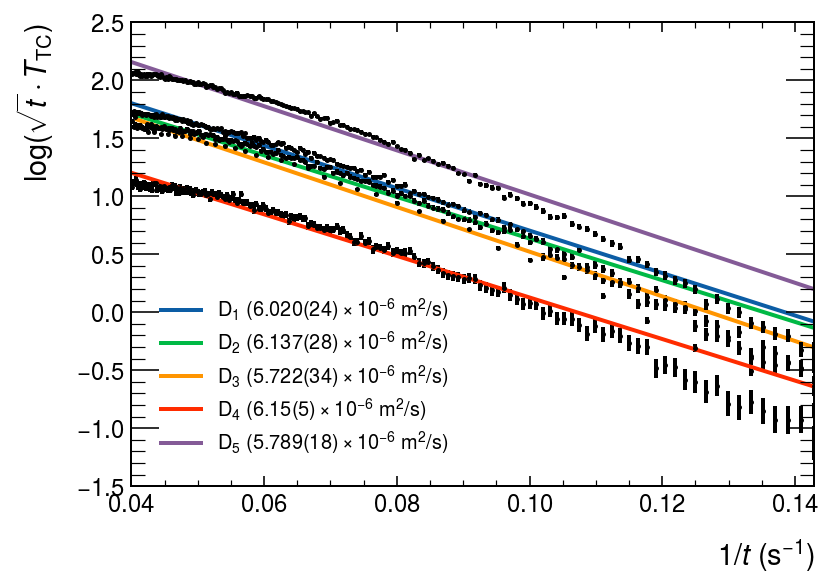
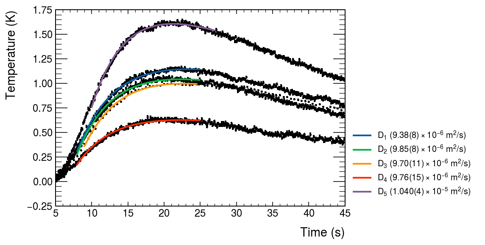

# Heat Transfer (L3)
**Mattia Sotgia1, Francesco Polleri 1** \
_1Dipartimento di Fisica, Università degli studi di Genova_

    Welcome to JupyROOT 6.24/02

## Analisi dati
Abbiamo acquisito 1200 punti (con frequenza di 10Hz) divisi in 4 dataset, divsi come
 - 2 dataaset (`20230321_1_1s` e `20230321_2_1s`) con impulso iniziale di ~1 s
 - 1 dataset con $\Delta_\text{pulse}$ = 0.5 e 1 dataset con 1.5 s

La `dataclass` Data contiene i dati necessari e anche una visualizzazione rapida, accessibile come `Data.prelim_plot()`, anche potendo esplorare limiti bassi e alti nei tempi. 

Importo i dati in un formato comodo per la trasformzione successiva. 

Possiamo così rapidamente analizzare i valori ottenuti (per esempio osservo subito che la temperatura del PT100 risulta invariante rispetto al tempo)

    

    

Data l'equazione per una sbarretta semi-infinita (correggo poi dopo con una restrizione del dominio), $$\frac{\partial T}{\partial t} = k \nabla T,$$ possiamo ottenere soluzione del tipo $$T(x,t) = \frac{C}{\sqrt{Dt}} \exp(-\frac{x^2}{4Dt}) + T_0.$$

### Linearizzazione

Posso osservare che graficando idealmente $$\log{\sqrt{t}T_\text{TC}} = \log\left(\frac{C}{\sqrt{D}} \exp(-\frac{x^2}{4Dt})\right)$$ contro $1/t$, allora diventa $f(1/t) = -\frac{x_0^2}{4Dt}$, che risulta essere più comoda da trattare

    

    

    ┌─────────────────────────────────────────────────────────────────────────    
    │ D = 6.020(24)e-06 m^2/s 	for D1 (samples/freq./pulse dur.: 1200/10.0Hz/1.0s)    
    │ (p-value: 0.0, χ2/df = (1817.8476961834785, 178.0))
    
    ┌─────────────────────────────────────────────────────────────────────────    
    │ D = 6.137(28)e-06 m^2/s 	for D2 (samples/freq./pulse dur.: 1200/10.0Hz/1.0s)    
    │ (p-value: 0.0, χ2/df = (1798.307217493346, 178.0))
    
    ┌─────────────────────────────────────────────────────────────────────────    
    │ D = 5.722(34)e-06 m^2/s 	for D3 (samples/freq./pulse dur.: 240/2.0Hz/1.0s)    
    │ (p-value: 0.0, χ2/df = (1053.1372633886742, 34.0))
    
    ┌─────────────────────────────────────────────────────────────────────────    
    │ D = 6.15(5)e-06 m^2/s 	for D4 (samples/freq./pulse dur.: 1200/10.0Hz/0.5s)    
    │ (p-value: 0.0, χ2/df = (587.720727364311, 178.0))
    
    ┌─────────────────────────────────────────────────────────────────────────    
    │ D = 5.789(18)e-06 m^2/s 	for D5 (samples/freq./pulse dur.: 1200/10.0Hz/1.5s)    
    │ (p-value: 0.0, χ2/df = (4222.008268631143, 178.0))
    

    <matplotlib.legend.Legend at 0x13dbe4070>

    

    

    ┌─────────────────────────────────────────────────────────────────────────    
    │ D = 9.38(8)e-06 m^2/s 	for D1 (samples/freq./pulse dur.: 1200/10.0Hz/1.0s)    
    │ (p-value: 0.2767813362014787, χ2/df = (177.37079810061437, 167.0))
    
    ┌─────────────────────────────────────────────────────────────────────────    
    │ D = 9.85(8)e-06 m^2/s 	for D2 (samples/freq./pulse dur.: 1200/10.0Hz/1.0s)    
    │ (p-value: 4.298003529956684e-05, χ2/df = (248.56490698562274, 167.0))
    
    ┌─────────────────────────────────────────────────────────────────────────    
    │ D = 9.70(11)e-06 m^2/s 	for D3 (samples/freq./pulse dur.: 240/2.0Hz/1.0s)    
    │ (p-value: 0.01701896911656875, χ2/df = (47.38212778982111, 29.0))
    
    ┌─────────────────────────────────────────────────────────────────────────    
    │ D = 9.76(15)e-06 m^2/s 	for D4 (samples/freq./pulse dur.: 1200/10.0Hz/0.5s)    
    │ (p-value: 0.9722753364820487, χ2/df = (133.81214947771915, 167.0))
    
    ┌─────────────────────────────────────────────────────────────────────────    
    │ D = 1.040(4)e-05 m^2/s 	for D5 (samples/freq./pulse dur.: 1200/10.0Hz/1.5s)    
    │ (p-value: 0.04571312740479816, χ2/df = (199.03721957384553, 167.0))
    

    <matplotlib.legend.Legend at 0x11cc36280>

    

    

